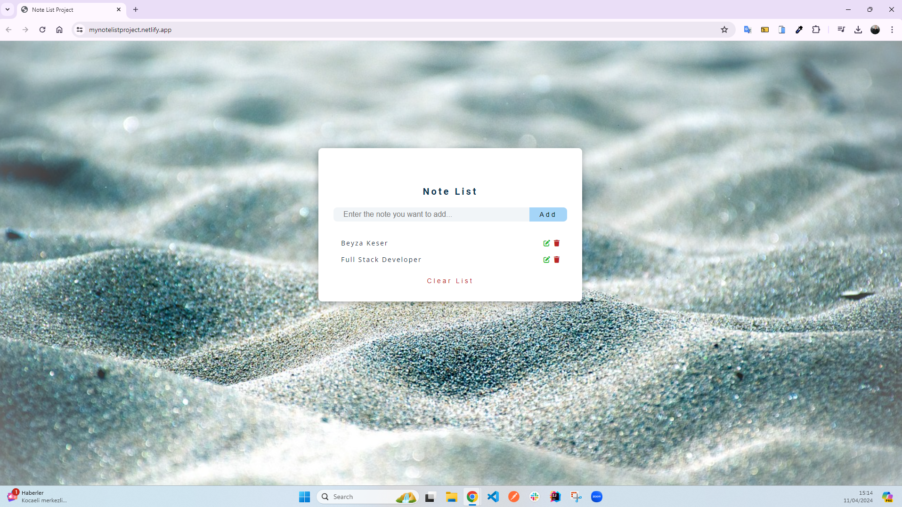

<h1>Note List Project</h1>

You can easily add, delete, and update your notes with a simple and useful note-taking application designed using HTML, CSS, and JavaScript. Ideal for your personal notes, to-do lists, or reminders. While doing all these things, you can save time thanks to its easy-to-use interface.

<h2> The following technologies were used in the frontend development phase of my site: </h2>

- HTML5
- CSS3
- JavaScript

<h2> Visit My Note List Project: </h2>

- https://mynotelistproject.netlify.app/

<h4>IMAGE</h4>

